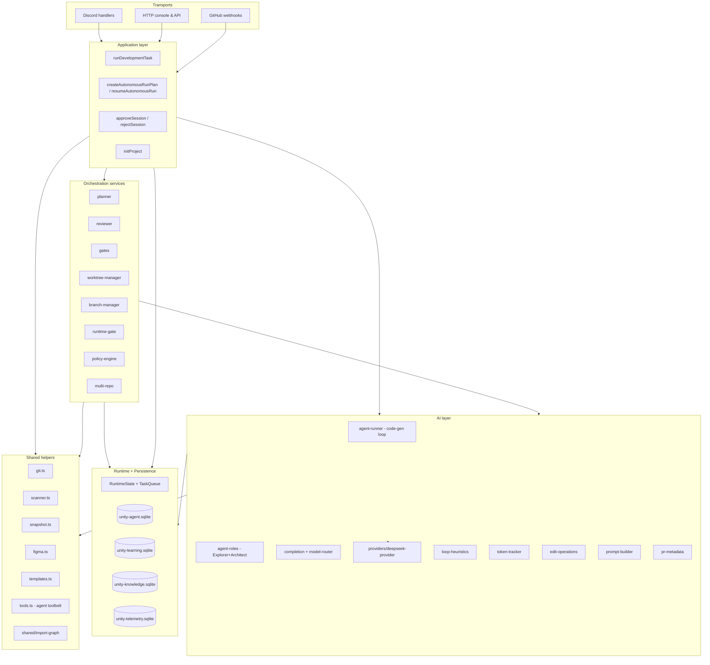

# Unity Agent / `brain-station` — Deep System Overview

> A living, opinionated description of **what this repository is, how it thinks, and why each piece exists**. This is the *server* — the control plane that plans, writes, validates, reviews and integrates code on behalf of a human operator who talks to it through Discord and a local HTTP console.

This document is intentionally long. It is organized so you can read it top-to-bottom to understand the whole brain, or jump directly to the subsystem you care about.

---

## Table of contents

1. [What this project is](#1-what-this-project-is)
2. [The two operating modes (manual / autonomous)](#2-the-two-operating-modes)
3. [High-level architecture map](#3-high-level-architecture-map)
4. [The end-to-end lifecycle of an autonomous run](#4-end-to-end-lifecycle)
5. [The agents — model, temperature, max tokens, thinking, reasoning effort](#5-agents-detailed)
6. [The tool layer the agents use](#6-tool-layer)
7. [Loop control — how we keep the agent from spiraling](#7-loop-control)
8. [Orchestration layer — planner, reviewer, gates, worktrees, branches](#8-orchestration-layer)
9. [Runtime gate — the config-driven "does it actually boot?" check](#9-runtime-gate)
10. [Persistence and the three SQLite stores](#10-persistence-three-sqlite-stores)
11. [Knowledge graph — evolving architectural memory](#11-knowledge-graph)
12. [Learning loop — learning from past success](#12-learning-loop)
13. [Telemetry and cost tracking](#13-telemetry)
14. [Policy engine and budgets](#14-policy-engine)
15. [Transports — Discord, HTTP console, GitHub webhooks](#15-transports)
16. [Runtime state and cross-run concurrency](#16-runtime-state)
17. [Git, workspaces, worktrees, scaffolding](#17-git-workspaces)
18. [Multi-repo orchestration](#18-multi-repo)
19. [Directory-by-directory reference](#19-directory-reference)
20. [Configuration and environment](#20-configuration)
21. [Data files on disk (`.unity/` and `workspaces/`)](#21-data-on-disk)

---

<a id="1-what-this-project-is"></a>
## 1. What this project is

`brain-station` is the **orchestrator**. It is not the product being modified; it is the process that modifies *other* Git repositories on the user's behalf.

It listens on two surfaces:

- **Discord**: two named channels — one for manual pair-programming, one for autonomous runs.
- **Local HTTP console** at `http://localhost:4477` (configurable): a web UI + JSON API for reviewing, approving, rejecting and inspecting runs.

When a prompt arrives, the orchestrator:

1. Prepares a clean Git workspace under `workspaces/<repoName>`.
2. Loads contextual signals: project tree, `.unityrc.md` project memory, optional Figma nodes, and the knowledge graph for that project.
3. Runs one of two flows:
   - **Manual (`jarvis-dev`)** — one single iteration, snapshot-first, with reply-based iteration and buttons to approve (→ PR) or revert.
   - **Autonomous (`unity-agent`)** — plan, approve, parallel execution inside isolated Git worktrees, gates, reviewer, improvement cycles, integration and closure.
4. Persists everything — runs, plans, tasks, events, artifacts, memories, policies, telemetry, learned patterns, knowledge graph — into three SQLite databases in `.unity/`.

The engine is built on top of **DeepSeek's `deepseek-v4-pro`** model through an OpenAI-compatible HTTP endpoint, with a provider abstraction so other providers can be swapped in.

The guiding philosophy is: **plan decoupled from execution, execution decoupled from integration, each task scoped tightly, nothing trusted on blind faith — everything passes through gates.**

---

<a id="2-the-two-operating-modes"></a>
## 2. The two operating modes

### 2.1 Manual mode — `#jarvis-dev`

Implemented in `src/application/run-development-task.ts` and the `messageCreate` handler in `src/transports/discord/register-handlers.ts`.

Semantics:

- A **single** monolithic generation on the active project.
- If the Discord message is a *reply to* the previous bot message, it is treated as an **iteration**: the workspace is reused and the current `git diff` is passed into the prompt as "short-term memory".
- If it is a fresh message, the workspace is reset (`git reset --hard HEAD && git clean -fd`), pulled, and reinstalled.
- The optional Figma JSON context is extracted from a link in the prompt if present.
- The agent loop (`generateAndWriteCode`) produces `edits` + `targetRoute` + `commitMessage`.
- After success a **Puppeteer screenshot** is taken at the target route (`snapshot.png`), along with Expo web preview and — when an API exists — a NestJS dev server.
- Discord receives: local URL, LAN URL, diff attachment, snapshot, and two action buttons:
  - `✅ Approve & PR` → generates a smart commit message from the full diff, opens a PR via the GitHub REST API.
  - `🗑️ Revert (Start Over)` → resets the workspace.

Concurrency: **one active task at a time** per runtime instance. A new message in `jarvis-dev` while a task is running is blocked with a transient warning.

### 2.2 Autonomous mode — `#unity-agent`

Implemented in `src/application/run-autonomous-agent.ts`. This is the main, modern flow.

Semantics:

- Two phases, strictly separated: **plan creation** and **plan execution**.
- Plan creation (`createAutonomousRunPlan`):
  1. Ensure workspace, ensure integration branch.
  2. Record **baseline static gates** (typecheck/lint/test/build/etc.) — this is the "what was already broken before we touched anything" snapshot.
  3. Ask the planner agent for a decomposed plan.
  4. Persist the plan. If `mode=nightly` and policy allows, auto-approve; otherwise wait for approval in the local console.
- Plan execution (`resumeAutonomousRun` → `executeApprovedRun`):
  1. Checkpoint recovery (reset interrupted tasks to pending).
  2. Loop until budget is exhausted:
     - Pick a parallelizable batch of ready tasks (scope-conflict-free) up to `maxParallelTasks`.
     - For each task, create a git worktree, run the Explorer→Architect pipeline, run the code-gen agent with scope + baseline context + learned patterns, commit inside the worktree, run scope / baseline-delta / scoped static gates, run the reviewer, and integrate via cherry-pick into the integration branch.
     - Collect follow-up suggestions from the reviewer; if the run still has budget, spin up an **improvement cycle**.
     - Close with final static gates + runtime gate + run-summary artifact.

---

<a id="3-high-level-architecture-map"></a>
## 3. High-level architecture map



---

<a id="4-end-to-end-lifecycle"></a>
## 4. End-to-end lifecycle of an autonomous run

A concrete trace, annotated:

1. **Prompt arrives** at `#unity-agent`. Handler blocks if another run is in flight (`runtime.isProcessing()`), else calls `createAutonomousRunPlan`.
2. **Workspace prep** (`prepareWorkspace`): if the repo exists, reset + pull; otherwise clone via HTTPS with the configured `GITHUB_TOKEN`. `scanWorkspaceTargets` detects Expo/Nest package dirs, then `npm install` is run per package.
3. **Knowledge graph seed**: if the graph has zero modules for the project, `scanProjectStructure` walks the import graph and registers modules, dependencies, dependents, exports.
4. **Integration branch** (`ensureIntegrationBranch`): fetch origin; either check out the upstream copy, or create it from the default branch and push it.
5. **Baseline static gates** (`runStaticGates`): per-package parallel execution of typecheck/tsc, lint, test, build, + security scan + import-cycle scan. Results stored as the `baseline-static-gates` artifact.
6. **Plan** (`planAutonomousRun`): planner agent returns strict JSON `{summary, tasks[]}`. Advisory-looking tasks (starting with verbs like "analyze") are dropped in favor of executable ones; dependencies are resolved by title.
7. **Plan persistence**: written to `plans` table with status `proposed` (or `approved` if auto-approve).
8. **Approval** (interactive mode): run sits in `awaiting_plan_approval` until someone POSTs to `/api/runs/:runId/approve-plan` from the console.
9. **Execution loop** — `executeApprovedRun`:
   - Refreshes the task list; computes the ready set = pending tasks whose deps are all `succeeded` or `skipped`.
   - `selectRunnableBatch` picks a conflict-free parallel batch up to `policy.maxParallelTasks`.
   - For each task in the batch (in parallel via `Promise.all`), `executeTask` runs:
     a. Create a git worktree branched off the integration branch (isolated `node_modules` only if the task's `writeScope` touches `package.json`/lockfiles).
     b. Re-run the scoped baseline static gates in the worktree.
     c. Build the **learning context** (inject past patterns that matched this task).
     d. Run the **Explorer → Architect** pipeline.
     e. Call `generateAndWriteCode` (the code-gen agent) with Figma, project memory, project tree, learned patterns, architect context, and baseline-failure list.
     f. Commit all changes in the worktree.
     g. Compute `git diff` vs. `HEAD~1`; check **scope gate** (no edits outside writeScope), **baseline-delta gate** (no newly-failing gates), and run the scoped static gates again.
     h. Call the reviewer agent with the diff and gate results.
     i. Extract a new learned pattern on success; record outcome for any applied patterns.
   - If the task succeeded, `integrateTaskResult` cherry-picks the worktree commit onto the integration branch, auto-resolves conflicts when possible, and pushes. On push failure, the cherry-pick is reverted so retry starts clean.
   - If the task failed and retries remain, it is reset to `pending` with an augmented prompt.
   - After the batch, the loop runs again unless: there are no ready tasks and no improvement drafts, the budget is exhausted, the closing window is active, or max commits is reached.
10. **Improvement cycle**: if reviewer suggested follow-up tasks and the loop ran out of direct tasks, they are materialized as new `improve`/`heal` tasks with `[Improvement N]` titles. Each cycle is bounded by `maxImprovementCycles`.
11. **Closing window**: the last `10 minutes` of the `maxHours` budget. Inside it, new improvement cycles are not opened and tasks receive a closing-window instruction: finish small, don't expand scope.
12. **Final gates + knowledge update**:
    - `runStaticGates` on the integration branch (final).
    - `runRuntimeGate` with the last `targetRoute` — actually spawn services and hit the URL.
    - Update knowledge graph with all changed files and per-file pass/fail.
13. **Closure assessment** (`assessRunClosure`): classifies the run as `completed`, `completed_with_warnings`, or `failed` based on required-task completion, new static failures, runtime failures, and incomplete follow-ups. Writes `run-close-report` artifact and upserts a `continuous_improvement` memory.
14. **Telemetry**: token usage was already being accumulated per call through `TokenTracker`; telemetry events for the run and its tasks were emitted along the way.

---

<a id="5-agents-detailed"></a>
## 5. The agents — full specification

All agents run on the **same physical model**: `deepseek-v4-pro`, accessed through `https://api.deepseek.com` via the OpenAI-compatible SDK. Specialization is achieved by:

- **Role name** — picks the config bundle.
- **Thinking toggle** — `{"type":"enabled"}` vs `{"type":"disabled"}` on the DeepSeek request body. When thinking is on, the provider passes `reasoning_effort` and the API ignores `temperature` and sampling penalties.
- **Reasoning effort** — `low | medium | high | max`.
- **Temperature, max_tokens, tools, response_format** — per role.

Source of truth: `src/services/ai/model-router.ts`. The whole map:

| Role | Model | Provider | Tier | Temp | Max tokens | Thinking | Reasoning effort | Purpose |
|---|---|---|---|---|---|---|---|---|
| `code-gen` | `deepseek-v4-pro` | `deepseek` | reasoning | 0.2 | 120 000 | **on** | `max` | Main code-writing loop (edits, patches, tool use) |
| `planning` | `deepseek-v4-pro` | `deepseek` | reasoning | 0.4 | 120 000 | **on** | `high` | Decompose a user prompt into a JSON plan of parallel tasks |
| `explorer` | `deepseek-v4-pro` | `deepseek` | reasoning | 0.2 | 120 000 | **on** | `high` | Read-only codebase exploration, produce exploration report |
| `architect` | `deepseek-v4-pro` | `deepseek` | reasoning | 0.3 | 120 000 | **on** | `max` | Turn the exploration report into a precise implementation plan |
| `review` | `deepseek-v4-pro` | `deepseek` | chat | 0 | 30 000 | off | — | Verdict on a task's diff vs its instruction and gate results |
| `repair` | `deepseek-v4-pro` | `deepseek` | chat | 0 | 25 000 | off | — | Repair malformed JSON outputs; rewrite reviewer output into canonical shape |
| `pr-metadata` | `deepseek-v4-pro` | `deepseek` | chat | 0.4 | 10 000 | off | — | Produce a conventional commit message + bullet list from a final diff |

Defined in: `src/services/ai/model-router.ts:44–111`.

The rationale for these values:

### `code-gen` — the implementer

- **Why thinking + `max` effort?** Patch correctness is the single biggest failure mode. The agent must reason about exact search/replace blocks, ambiguous matches, baseline failures to ignore, and scope boundaries. It is worth every thinking token.
- **Why `temperature: 0.2`?** Low but non-zero — we want determinism in decisions (which file, which pattern) but still a small amount of surface variation when exploring alternative wording in names/messages. Note: when `thinking: true`, DeepSeek ignores temperature anyway; the value is only used if someone calls the role with `thinking: false` override.
- **Why `maxTokens: 120_000`?** Thinking-mode outputs are long. The final JSON can also include multi-file patches. The 120k cap is the DeepSeek-supported ceiling we use as a safety net — actual spend is governed by the project-level `maxTokensPerRun` and `maxTokensPerTask` budgets enforced by `TokenTracker`.
- **Tools:** the full toolbelt — `read_file`, `grep_code`, `search_project`, `list_directory`, `find_references`, `run_command`, `run_tests`, `write_file`. Defined in `src/tools.ts`.
- **Where it is called:** `generateAndWriteCode()` in `src/services/ai/agent-runner.ts`, which is called by both manual (`runDevelopmentTask`) and autonomous (`executeTask`) flows.

### `planning` — the planner

- **Why thinking on, effort `high` (not `max`)?** Planning needs robust reasoning about dependencies, file paths, monorepo package prefixes, and cohesion — but the output is small JSON. `max` effort would cost tokens without improving plan quality measurably in testing.
- **Why `temperature: 0.4`?** The planner benefits from a small amount of creativity — surfacing a parallelizable decomposition the user didn't explicitly ask for. Still cold enough to stay coherent.
- **Why `maxTokens: 120_000`?** Same reasoning-mode safety ceiling. Plans themselves are ~2–10KB.
- **Tools:** none — the planner is a pure text-in, JSON-out agent with `response_format: { type: 'json_object' }`.
- **Where it is called:** `planAutonomousRun()` in `src/services/orchestration/planner.ts`, invoked from `createAutonomousRunPlan`. Also called by `planMultiRepoRun()` for cross-repo plans.
- **Retry strategy:** if the primary call returns empty content or non-JSON (a known edge case of thinking + json_object combined), we retry **with thinking disabled** — DeepSeek's documented stable combo for structured output.

### `explorer` — the read-only investigator

- **Why thinking on, effort `high`?** The Explorer must translate a fuzzy user goal into the right few files to read. Effort `high` is the sweet spot — `max` caused it to re-read files redundantly in past runs.
- **Why `temperature: 0.2`?** Low determinism; exploration is not creative.
- **Tools:** read-only subset — `read_file`, `grep_code`, `search_project`, `list_directory`, `find_references`, `run_command` (for `git log` / `ls`-style inspections). It *cannot* write.
- **Where it is called:** `runExplorerAgent()` in `src/services/ai/agent-roles.ts`, invoked from `runAgentPipeline()` inside `executeTask` for every autonomous task.
- **Termination:** max 30 iterations or earlier when `loop-heuristics` detect spirals; on termination without a report, there is a deterministic keyword-based fallback (`findEntryPointsByKeywords`) that grep+find the top candidate files so the Architect is never blind.

### `architect` — the designer

- **Why thinking on, effort `max`?** Its output is short but load-bearing: the exact file changes, their order, pseudo-code, and risk call-outs. Getting this wrong pollutes the implementer. `max` effort pays here.
- **Why `temperature: 0.3`?** Slightly higher than Explorer — the Architect produces a plan that can phrase alternatives. Again, irrelevant when thinking is on.
- **Tools:** none. Pure reasoning over the Explorer's report.
- **Where it is called:** `runArchitectAgent()` in `src/services/ai/agent-roles.ts`, right after the Explorer inside `runAgentPipeline`.

### `review` — the judge

- **Why thinking off, temperature 0?** The reviewer is a structured verdict machine. We want the same inputs to always produce the same outputs. It is called with `response_format: json_object` and given authoritative gate results to lean on.
- **Why `maxTokens: 30_000`?** The diff is capped at `24_000` chars inside the prompt (`formatDiffForReview`), so the answer never needs more than a few KB. 30k is a comfortable upper bound.
- **Tools:** none.
- **Where it is called:** `reviewTaskResult()` in `src/services/orchestration/reviewer.ts`, after every task's diff has passed compilation and gates.
- **Fallback ladder:** primary call → `repair` role normalizes malformed JSON → **deterministic fallback** (`buildDeterministicFallbackReview`) built purely from gate results if the LLM cannot be trusted.

### `repair` — the JSON mechanic

- **Why thinking off, temperature 0?** Its job is purely syntactic: take garbled output and emit valid JSON. No creativity needed.
- **Why `maxTokens: 25_000`?** Plenty for reshaping a moderately-sized output.
- **Where it is called:**
  - `reviewer.ts` when the primary reviewer returns non-JSON or invalid JSON.
  - `pattern-extractor.ts` to generate a 2–3 sentence "approach summary" for a learned pattern (we chose this role because it is cheap, deterministic, and always available).

### `pr-metadata` — the commit writer

- **Why thinking off, temperature 0.4?** This is a style task (write a human-quality Conventional Commit title + bullets). A bit of temperature helps produce nice prose; thinking would be overkill for a one-shot summary.
- **Why `maxTokens: 10_000`?** A commit message is tiny; 10k is already far beyond generous.
- **Where it is called:** `generatePRMetadata()` in `src/services/ai/pr-metadata.ts`, from `approveSession()` when a manual session is being promoted to a Pull Request.

### Where roles come together — `completion.ts`

`roleCompletion(role, request)` is the **only** entry point call sites use. It:

- Reads the role's config from `getModelConfig(role)`.
- Resolves the provider (`resolveProvider` — currently `DeepSeekProvider`, with registry-based fallback).
- Maps role config into an `LLMCompletionRequest`.
- Records token usage against the run/task in `TokenTracker` and throws if the budget is exceeded.

This means runtime overrides (e.g. forcing `thinking: false` in a retry path) are one-liner overrides on the call — see `planner.ts` retry path.

### The DeepSeek provider

File: `src/services/ai/providers/deepseek-provider.ts`.

Behaviors worth knowing:

- When thinking is enabled, we **omit** `temperature` from the payload (DeepSeek ignores it anyway and leaving it in caused noise in some historical responses).
- We always set `thinking: { type: 'enabled' | 'disabled' }` explicitly — relying on defaults is unstable across versions.
- `reasoning_content` from the response is preserved **verbatim**, including empty strings. This is critical: DeepSeek requires the *exact* `reasoning_content` string to be echoed back on subsequent requests whenever that assistant turn included tool calls. Dropping it triggers HTTP 400 on the very next turn.
- The transport layer (`src/services/ai/client.ts`) retries up to 3 times on transient errors (`ECONNRESET`, `ETIMEDOUT`, 408/409/429/5xx, `UND_ERR_CONNECT_TIMEOUT`, etc.) with 750ms × attempt backoff. `DEEPSEEK_DEBUG=1` enables payload dumps on 400s to help debug reasoning-content mismatches.

---

<a id="6-tool-layer"></a>
## 6. The tool layer the agents use

File: `src/tools.ts`. Single responsibility: give the agents safe, bounded, repo-scoped tools that return text.

Each tool is declared in OpenAI function-calling format (`agentTools`) and dispatched by `createAgentToolRuntime(repoPath)`. All paths are validated through `resolveSafePath` which blocks any escape above `repoRoot`.

### `read_file`
- **Purpose:** read a file or a line range from it.
- **Why:** reading entire files is the biggest token sink. `startLine`/`endLine` (default 1–500) with prefixed line numbers keeps reads cheap.
- **Guardrails:** fails if path escapes the repo.

### `grep_code`
- **Purpose:** regex search with optional file glob + optional context lines.
- **Why:** more powerful than keyword search for patterns like `export.*function\s+handle`. Capped at 30 hits by default (max 100) with max 5 lines of context.
- **Guardrails:** invalid regex returns an error string; ignores `IGNORE_DIRS` (`node_modules`, `.git`, `dist`, `build`, `coverage`, `.expo`, `ios`, `android`, `.next`).

### `search_project`
- **Purpose:** substring search (the original, kept for backward compat).
- **Why:** simpler and cheaper than `grep_code` when the agent only needs "does `UserService` appear anywhere?".

### `list_directory`
- **Purpose:** tree-format listing with sizes, optional file glob, max depth 3 (configurable up to 6).
- **Why:** beyond the initial project tree (which is depth-2), the agent sometimes needs to drill in.

### `find_references`
- **Purpose:** import + usage discovery for a symbol.
- **Why:** when about to rename or refactor a function, we want the categorized breakdown of imports vs usages (capped at 50 hits).

### `run_command`
- **Purpose:** execute a sandboxed bash command in the repo.
- **Why:** validation (`npm run lint/test/typecheck/build`), inspection (`ls`, `find`, `grep`, `cat`, `sed -n`, `git status/diff/log`), compile checks (`npx tsc --noEmit`), Expo helpers (`npx expo start/doctor/lint/--version`), test runners (`npx jest`, `npx vitest`).
- **Guardrails — aggressive allow-listing:**
  - Blocks `..` path traversal, absolute paths (except `/dev|/tmp`), `~`, `;`, `||`, `>`, `<`, single `&` background, backticks, `$(...)`.
  - Accepts `&&` chains, each segment independently allow-listed.
  - Pipes only accepted if **every** segment is read-only.
  - Output truncated at 12k chars / 300 lines, 30s timeout.

### `run_tests`
- **Purpose:** targeted test execution.
- **Why:** distinguishes Jest vs Vitest from `package.json` and runs with `CI=true NODE_ENV=test`, 60s timeout (max 120s), longer than `run_command` because tests take longer than lints.

### `write_file`
- **Purpose:** create or overwrite a file mid-loop.
- **Why:** when a brand new file is cleaner than a search/replace patch. The agent is required to *either* return `edits: []` after calling `write_file` *or* return patch edits — not both (that causes double-apply loops).

### Tool scoping per role

Defined in `src/services/ai/agent-roles.ts:27–34, 37–44`.

- **Explorer allow-list:** `read_file`, `grep_code`, `search_project`, `list_directory`, `find_references`, `run_command`. No writes.
- **Implementer allow-list:** `read_file`, `grep_code`, `search_project`, `write_file`, `run_tests`, `run_command`. (The code-gen role in `agent-runner.ts` actually gets the *full* `toolRuntime.tools` set — the restricted set above is used if/when Implementer is explicitly filtered; in the current code path, the main code-gen loop has broad access but its prompt restricts it).

---

<a id="7-loop-control"></a>
## 7. Loop control — how we keep the agent from spiraling

File: `src/services/ai/loop-heuristics.ts`. Called from `agent-runner.ts:111` and `agent-roles.ts:269` on every iteration.

The problem: a reasoning model with tools can enter two failure modes — **cyclic spiraling** (same 3 calls over and over) and **broad exploration** (lots of low-value searches). Left alone it burns budget and produces nothing.

The solutions, layered:

- **Spiral detection (`detectSpiralPattern`)**
  - Compares the last 3 tool-call descriptors to the 3 before them. Exact match → spiral.
  - Counts how many times the most recent call appeared in history; 4+ → spiral.

- **Information gain (`measureInformationGain`)**
  - Over the last 4 calls, what fraction are new relative to prior calls?
  - ≥ 0.5 → `high`. ≥ 0.25 → `low`. Else → `stale`.

- **Broad exploration counter (`countBroadExplorationCalls`)**
  - `search_project` with ≤5-char keyword, `list_directory` of root, `grep_code` with ≤4-char pattern → suspicious.

- **Has-enough-evidence (`hasEnoughTargetEvidence`)**
  - ≥ 2 unique files read + ≥ 1 search/reference call + combined ≥ 4 → enough context.

- **Combined decision (`evaluateLoopControl`)** — called from `agent-runner.ts`:
  - Spiral → redirect.
  - Stale gain + enough evidence → redirect.
  - ≥ 3 broad calls + enough evidence → redirect.
  - Iteration ≥ 15 + enough evidence → redirect.
  - Iteration ≥ 25 → hard redirect regardless.

- **Redirect escalation** in `agent-runner.ts:113–155`:
  - First 2 redirects: append a natural-language push to produce the implementation.
  - **3rd consecutive redirect → hard redirect**: we strip the `tools` parameter and force `response_format: { type: 'json_object' }`, so the agent literally cannot call tools anymore and must emit the final JSON.
  - Spiral telemetry is emitted via `telemetry.redirectSpiral(...)`.

Additionally, the Explorer has its own spiral guard at `agent-roles.ts:269–283`: on spiral detection, it is forced to produce the exploration report *now* using whatever context it has.

---

<a id="8-orchestration-layer"></a>
## 8. Orchestration layer

### 8.1 Planner — `src/services/orchestration/planner.ts`

- Input: `prompt`, `projectTree`, `projectMemory`.
- Prompt contract (`buildPlannerPrompt`):
  - "Decompose the request into the most granular set of **independently executable** tasks."
  - Scopes must be **repo-root-relative** concrete file paths (monorepo package prefix mandatory — getting this wrong breaks the scope gate).
  - Dependencies only when a task literally must import or edit something a previous task creates.
  - Each task prompt must be self-contained (executor never sees the run prompt, only the task prompt).
- Output: strict JSON `{summary, tasks[]}`. Advisory tasks ("analyze X") are dropped; if all tasks look advisory we keep them to avoid returning zero tasks.
- Normalization (`normalizePlanTasks`):
  - Every task gets an explicit `buildExecutionContract(prompt, writeScope)` wrapper — reinforcing "produce code, stay in scope, don't chase unrelated errors".
  - Dependencies are filtered to titles that still exist in the selected task set.
- Retry: if the primary response under thinking mode is empty / non-JSON, retry with `thinking: false` + `response_format: json_object`.
- Fallback: on any crash, produce a single-task plan that tells the executor to "do whatever the user said".

### 8.2 Reviewer — `src/services/orchestration/reviewer.ts`

- Input: `runPrompt`, `taskTitle`, `taskPrompt`, `diff`, `gateResults[]`.
- Prompt contract (`buildReviewPrompt`):
  - The TASK INSTRUCTION is authoritative, not the run goal. Reviewing against the run goal is explicitly forbidden because sibling tasks handle the other parts.
  - Gates are authoritative: if scope=passed and baseline-delta=passed the task is mechanically healthy; approve unless it obviously didn't implement the instruction.
  - Truncated diffs are **not** a reason to reject — the full patch already compiled.
- Output: `{approved, summary, findings[], followUpTasks[]}`.
- Fallback ladder:
  1. Primary `review` call with `json_object`.
  2. On parse failure, `repair` role is invoked to normalize the output.
  3. On persistent failure, `buildDeterministicFallbackReview` builds a verdict purely from gate results (+ diff-level heuristics like TODO/FIXME detection and "touched >8 files" warnings).

### 8.3 Gates — `src/services/orchestration/gates.ts`

Three kinds:

- **Per-package static gates (parallel):**
  - `typecheck` → `npm run typecheck` if present, else `npx tsc --noEmit` if `tsconfig.json` exists.
  - `lint` → `npm run lint` if present.
  - `test` → `npm run test` if present and script is not the default `no test specified` placeholder.
  - `build` → `npm run build` if present.
  - Per-gate timeouts: typecheck/tsc=90s, lint=60s, test=180s, build=120s.
- **Synchronous single-pass gates:**
  - `security-scan` — greps source files within scope for a curated set of secret patterns (API key literals, AWS keys, GitHub tokens, OpenAI/Stripe sk- keys, JWTs, PRIVATE KEY headers). Allow-lists `.env.example`, `.test.`, `fixture`, `mock` files.
  - `import-cycles` — builds an import graph via `shared/import-graph.ts` and runs DFS cycle detection.
- **Runtime gate** (see next section).

`runStaticGates(workspace, policy, scopes)` filters packages by scope and batches all per-package tasks + synchronous gates through `Promise.all`, so a 4-package monorepo with typecheck+lint+test+build runs as ~16 concurrent processes.

### 8.4 Scope and baseline-delta gates

These two are computed **in `run-autonomous-agent.ts`**, not in `gates.ts` — they are per-task and depend on the diff.

- **Scope gate** (`run-autonomous-agent.ts:640–655`): uses `getOutOfScopePaths` to detect any `diff --git a/X b/Y` where `Y` is not inside any declared `writeScope`. Monorepo package-prefix stripping handles the `kubo-mobile/app/file.tsx` vs `app/file.tsx` pitfall.
- **Baseline-delta gate** (`run-autonomous-agent.ts:658–664`): compares the scoped static results *after* the edits against the baseline static results; any gate that flipped from non-failed to failed counts as a regression.

Both are synthesized into `GateResult` rows and fed to the reviewer. A failed scope gate or baseline-delta gate is authoritative: the task is marked failed regardless of what the reviewer says.

### 8.5 Worktree manager — `src/services/orchestration/worktree-manager.ts`

- Creates `workspaces/.unity-worktrees/<runId>/<taskId>` as an isolated git worktree branched off the integration branch.
- Guarded by an in-memory mutex (`WorktreeMutex`) so concurrent `worktree add/remove/prune` calls don't stomp on each other.
- **node_modules sharing strategy:**
  - Default: symlink each package's `node_modules` from the base workspace. Fast, cheap.
  - If the task's `writeScope` touches `package.json`, `package-lock.json`, `yarn.lock` or `pnpm-lock.yaml`, the task gets its **own** `node_modules` via `npm install --prefer-offline`. Prevents mutual corruption when two tasks modify deps in parallel.
- `.env` is copied (not symlinked) so each task has its own isolated env.

### 8.6 Branch manager — `src/services/orchestration/branch-manager.ts`

- `detectDefaultBranch`: tries `git symbolic-ref refs/remotes/origin/HEAD`, then `git remote show origin`, then falls back to the configured `GITHUB_BASE_BRANCH` (default `main`).
- `ensureIntegrationBranch`: fetch + prune → if the branch exists on remote, check it out and pull; else create from default branch and push.
- `cherryPickCommit`: attempts a cherry-pick. On conflict, it grabs the list of conflicted files and tries `git checkout --theirs` + re-add for each (the working theory being "the incoming task's change is the intended state for those files"). On success → `git cherry-pick --continue` with `GIT_EDITOR=true` to avoid the editor.
- `pushBranch` wraps `git push` with `withRetry` — 3 attempts on transient network errors (SSL, DNS, connection reset, `fetch first`).

### 8.7 Policy engine — `src/services/orchestration/policy-engine.ts`

See [section 14](#14-policy-engine).

### 8.8 Runtime-gate config — `src/services/orchestration/runtime-gate-config.ts`

See [section 9](#9-runtime-gate).

### 8.9 Multi-repo — `src/services/orchestration/multi-repo.ts`

See [section 18](#18-multi-repo).

---

<a id="9-runtime-gate"></a>
## 9. Runtime gate

File: `src/services/orchestration/runtime-gate.ts` + `runtime-gate-config.ts`.

Goal: answer "does the code *actually boot and respond*?" — not just "does it compile?".

Resolution order:

1. **Manual config**: if `<repo>/.unity/gates.json` exists, use its services verbatim.
2. **Auto-detection** from `package.json` of the detected Expo dir and API dir:
   - NestJS API: `npm run start`, wait for `Nest application successfully started`, port 3000.
   - Generic Node backend (if `scripts.start` or `scripts.start:dev`): `npm run start:dev || npm run start`, wait for `listening`, port 3000.
   - Expo web: `npx expo start --web --port 8081`, wait for `ready in`, port 8081.
   - Next.js: `npm run dev`, wait for `Ready in`, port 3000.
   - Vite: `npm run dev`, wait for `ready in`, port 5173.

Execution:

- Start backends first, then frontends. If both present, inject `EXPO_PUBLIC_API_URL=http://<LAN-IP>:<backend-port>` into the frontend's `.env` before starting it.
- Each service has its own `timeoutMs` (default 30s). Ready is detected by scanning combined stdout/stderr for the ready signal string.
- On failure of any service, the gate returns `status: 'failed'` with the tail of the service log.
- On success, `runtime:url` is reported with the LAN and local URLs (based on the `targetRoute` from the last task).

Process hygiene: `cleanupActiveProcesses` kills any tracked processes from previous runtime-gate invocations, and `fuser -k <port>/tcp` clears the port before starting.

---

<a id="10-persistence-three-sqlite-stores"></a>
## 10. Persistence — three SQLite stores

Everything persistent lives under `.unity/` and uses Node 22's built-in `node:sqlite` with WAL journal mode.

### 10.1 `unity-agent.sqlite` — operational state

File: `src/services/persistence/unity-store.ts`.

Tables:

- `runs` — the run itself (prompt, status, policy snapshot — `maxParallelTasks`, `maxHours`, etc. — branch names, summary).
- `plans` — one row per plan version. Columns for approval/rejection include `approved_at`, `approved_by`, `rejected_at`, `rejected_by`, `rejected_reason`.
- `tasks` — per-task state: prompt, role, kind, status, write scope, dependencies, attempts, branch name, worktree path, commit sha/message, output summary, validation summary, `order_index` (used for advisory sorting).
- `events` — structured timeline: level (`info|warning|error`), type (`run.created`, `task.integrated`, `run.closing_window`, …), message, JSON payload.
- `artifacts` — binary/text artifacts per run: `plan`, `baseline-static-gates`, `final-static-gates`, `runtime-gates`, `diff` (per task), `run-close-report`.
- `memories` — three-layer memory (`stable_repo`, `run_context`, `continuous_improvement`), keyed by `(project_name, layer, memory_key)`.
- `policies` — per-project `AutonomousRunPolicy` JSON blob.
- `night_jobs` — queued night-job metadata (scaffolding for scheduled runs; the scheduler itself is not wired up in this tree).

Schema migration is additive: on startup, `migrate()` calls `ensureColumn(...)` for each plan approval/rejection column so existing DBs upgrade cleanly.

Checkpoint recovery:

- `listResumableRuns()` returns runs stuck in `running` or `healing`.
- `getRunProgress(runId)` counts completed/failed/pending tasks.
- `resetInterruptedTasks(runId)` flips `running` tasks back to `pending` and clears worktree metadata — called on resume in `resumeAutonomousRun`.

### 10.2 `unity-knowledge.sqlite` — architectural memory

File: `src/services/knowledge/knowledge-graph.ts`. See [section 11](#11-knowledge-graph).

### 10.3 `unity-learning.sqlite` — learned patterns

File: `src/services/learning/learning-store.ts`. See [section 12](#12-learning-loop).

### 10.4 `unity-telemetry.sqlite` — telemetry

File: `src/services/telemetry/telemetry-store.ts`. See [section 13](#13-telemetry).

---

<a id="11-knowledge-graph"></a>
## 11. Knowledge graph

The goal is to make the system **better over time at a specific project** by remembering architecture, hot files, fragile areas, API surface, and architecture decisions.

Tables in `unity-knowledge.sqlite`:

- `modules` — per-project module (first 2 path segments) with `module_type`, `exports[]`, `dependencies[]`, `dependents[]`, `change_frequency`, `failure_frequency`, `notes[]`.
- `api_endpoints` — `(method, path, source_file)` with consumers.
- `architecture_decisions` — ADR-style records: title, description, context, affected paths, source run id.
- `file_change_log` — append-only log of every file edit: path, run id, task id, change type (`create|modify|delete`), `gate_passed`.

Derived queries:

- `getHotFiles(projectName)` — top files by change count, with failure count.
- `getFragileAreas(projectName)` — modules ranked by `failure_frequency / change_frequency` ("fragility score").

Integration points:

- **Seed**: on first run for a project, `scanProjectStructure` walks the repo's import graph (via `shared/import-graph.ts`) and creates one module row per `<segment1>/<segment2>` pair, deriving `moduleType` from path heuristics (`component`, `service`, `route`, `test`, …), exports from regex-scanning up to 10 files per module.
- **Update after each run**: `updateAfterRun({projectName, runId, changedFiles})` called at the end of `executeApprovedRun`. Every changed file writes a `file_change_log` row and increments the parent module's `change_frequency` (and `failure_frequency` if gate_passed is false).
- **Prompt injection**: `buildPromptContext(projectName)` builds a concise ~2000-token summary (fragile areas, hot files, API surface, recent architecture decisions) that the **Explorer** prompt consumes (`agent-roles.ts:67–75`). This is how past failures warn future exploration.

---

<a id="12-learning-loop"></a>
## 12. Learning loop

The learning loop answers: *when we solve a similar task in the future, can we skip straight to the approach that worked?*

Three files:

- `learning-store.ts` — SQLite store, pattern CRUD, effectiveness scoring.
- `pattern-extractor.ts` — distill a successful task into a reusable pattern.
- `prompt-injector.ts` — find matching patterns for a new task and format them as guidance.

### Extraction (after a task succeeds)

Triggered at `run-autonomous-agent.ts:704` in `executeTask`. The trace includes iteration count, tokens, tool history, files read, files edited, task kind, write scope, and the commit message.

Rules (`pattern-extractor.ts`):

- Skip trivial tasks (0 edits, or 1 iteration + 1 edit).
- Compute the dominant **file pattern** (longest common prefix of edited files).
- Compute **top tools** (most-used tool names).
- Extract **keyword tags** from the task title + prompt using a stop-word filter.
- De-duplicate: don't save if an existing pattern scores > 0.85 relevance and has the same file pattern + kind.
- Generate a 2–3 sentence "approach" summary using the `repair` role; fall back to a structured template if the LLM call fails.
- Insert with `times_applied = times_succeeded = times_failed = 0` and `effectiveness_score = 0`.

### Injection (before a task runs)

Triggered at `run-autonomous-agent.ts:554` via `buildLearningContext`.

- `findRelevantPatterns` pulls candidate patterns where `project_name = X` OR `effectiveness_score > 0.7` (cross-project bleed is allowed for high-trust patterns).
- **Relevance scoring** (`scorePatternRelevance`):
  - Same project: +0.3
  - Same task kind: +0.2
  - Scope overlap: +0.25 × overlap ratio
  - Tag/keyword overlap: +0.25 × overlap ratio
  - Effectiveness bonus after ≥ 2 applications: +0.1 × effectiveness_score
  - **Temporal decay**: patterns older than 90 days gradually lose relevance (floor 30%).
- Top 3 matches formatted as a prompt section titled "LEARNED PATTERNS (from previous successful runs)".

### Outcome tracking

After every task finishes, `recordPatternOutcomes` appends to `pattern_outcomes` and updates the pattern's applied/succeeded/failed counters and effectiveness score (`(success - failed) / applied`).

### Pruning

Probabilistic (~10% chance per outcome recording):

- `pruneIneffectivePatterns(minApplied=3, minScore=-0.5)` — delete patterns with ≥ 3 applications and score < −0.5.
- `deduplicatePatterns` — group by `(project, kind, file_pattern)` and keep the best-scoring one.

---

<a id="13-telemetry"></a>
## 13. Telemetry and cost tracking

Two distinct pieces:

### `TokenTracker` — in-memory budget enforcement

File: `src/services/ai/token-tracker.ts`.

- Singleton keyed by `runId` and `runId:taskId`.
- `record(runId, taskId, tokens)` accumulates; returns `{status: 'ok'|'warning'|'exceeded', message}`.
- `status: 'exceeded'` causes `roleCompletion` to throw `Error(\`Token budget exceeded: ...\`)`, which propagates up and fails the current task gracefully.
- Warning threshold: 75% of budget.
- Enforces the per-task and per-run limits defined in policy:
  - `maxTokensPerRun` (default 2 000 000)
  - `maxTokensPerTask` (default 500 000)

### `TelemetryStore` — SQLite structured events

File: `src/services/telemetry/telemetry-store.ts`.

Every event has: event name (`task.started`, `task.completed`, `task.failed`, `gate.<name>`, `run.started`, `run.completed`, `edit.applied`, `edit.failed`, `agent.redirect_spiral`), run id, task id, project, duration, tokens in/out/total, cost USD, model, status, and metadata JSON.

Cost estimation is built-in: `MODEL_COST_PER_1M` maps `deepseek-v4-pro → $2.19/1M tokens` plus historical fallbacks (`deepseek-reasoner`, `deepseek-chat`, Claude Opus/Sonnet/Haiku 4 families) so legacy rows still resolve a cost.

Derived queries:

- `getRunCostSummary(runId)` — total tokens, total USD, model breakdown.
- `getTaskCosts(runId)` — per-task breakdown.
- `getProjectStats(projectName, days)` — rolling N-day totals.
- `getGateStats(projectName, days)` — pass/fail/skip counts per gate name.
- `getEditMetrics(projectName, days)` — applied vs failed edits, fuzzy-match count.

These feed the `/analytics` dashboard in the HTTP console.

---

<a id="14-policy-engine"></a>
## 14. Policy engine

File: `src/services/orchestration/policy-engine.ts`.

An `AutonomousRunPolicy` controls budgets, concurrency, and which gates run. Stored in `unity-agent.sqlite` per project.

### Defaults (`getDefaultAutonomousRunPolicy`)

| Field | Default | Notes |
|---|---|---|
| `integrationBranchName` | `UNITY_INTEGRATION_BRANCH` (fallback `unity-per2323455632`) | Source of truth for where task commits land |
| `autoApprovePlan` | `true` | But UI flows still only auto-approve when `mode === 'nightly'` |
| `maxParallelTasks` | 3 | Clamped 1–6 |
| `maxRetriesPerTask` | 2 | Clamped 0–5 |
| `maxImprovementCycles` | 2 | Clamped 0–4 |
| `maxHours` | 1 | Clamped 1–4 |
| `maxCommits` | 8 | Clamped 1–50 |
| `maxTokensPerRun` | 2 000 000 | Enforced by `TokenTracker` |
| `maxTokensPerTask` | 500 000 | Enforced by `TokenTracker` |
| `maxMinutesPerTask` | 30 | Clamped 5–120 (currently declared but the task-level timer is disabled in `executeTask`, flagged as TODO) |
| `gates.runTypecheck` | `true` | |
| `gates.runLint` | `true` | |
| `gates.runTests` | `true` | |
| `gates.runBuild` | `true` | |
| `gates.runRuntime` | `true` | |
| `gates.requireRuntimeForUi` | `true` | |
| `gates.captureSnapshot` | `false` | Autonomous default is off; manual flow always captures |
| `gates.runSecurityScan` | `true` | |
| `gates.runImportCycleCheck` | `true` | |

### Presets

`applyPolicyPreset(base, 'conservative'|'balanced'|'aggressive')` — curated bundles of budget overrides for the `/policy preset:<name>` slash command:

- **conservative**: 1 parallel task, 1 retry, 1 improvement cycle, 1 hour, 4 commits, 1M tokens/run, 250k tokens/task, `autoApprovePlan: false`.
- **balanced**: the default.
- **aggressive**: 6 parallel, 3 retries, 4 improvement cycles, 4 hours, 25 commits, 5M tokens/run, 1M tokens/task, auto-approve on.

---

<a id="15-transports"></a>
## 15. Transports

### 15.1 Discord — `src/transports/discord/register-handlers.ts`

Handles two event types:

**`messageCreate`** — routes to manual or autonomous flow based on channel name.

- Manual: starts a thread, streams `onProgress` / `onAgentStatusUpdate` (which renders the agent's `thought` under a "💭" bullet), attaches diff and snapshot, posts approve/reject buttons.
- Autonomous: starts a thread, calls `createAutonomousRunPlan`, posts the plan summary + per-task breakdown + console URL for approval. Execution itself is not triggered from Discord — only the local console triggers `resumeAutonomousRun`.

**`interactionCreate`** — two kinds:

- **Buttons**:
  - `cancel_task` → `runtime.abortCurrentTask()`
  - `approve:<projectName>:<sessionId>` → `approveSession` → opens PR
  - `reject:<projectName>:<sessionId>` → `rejectSession` → `git reset --hard`
- **Slash commands**:
  - `/status` — active project, runtime state, queue metrics, policy snapshot.
  - `/workon repo:<name>` — `runtime.setActiveProject` + `prepareWorkspace`.
  - `/policy [preset:conservative|balanced|aggressive] [hours] [commits] [parallel] [retries] [improvements] [autoapproveplan]` — applies preset or individual overrides.
  - `/cost run:<id>` — telemetry summary.
  - `/learning` — top patterns and project-level learning stats.
  - `/init type:<expo|nest|fullstack> name:<name>` — scaffold a new project.

### 15.2 HTTP console — `src/transports/http/server.ts`

Single `createServer` (no framework). Raw route dispatch, server-rendered HTML plus JSON API.

Pages:

- `/` — home with runs list and metrics.
- `/runs/:runId` — full run detail (graph, task list, inspector, events, artifacts, diff viewer).
- `/analytics` — cross-project cost + gate stats + edit metrics.
- `/knowledge` — hot files, fragile areas, API endpoints, architecture decisions, recent file changes.
- `/learning` — pattern browser + per-pattern outcome history.
- `/settings` — per-project policy editor.

API endpoints (used by the UI and callable externally):

- `GET /health`
- `GET /api/runs` / `GET /api/runs/resumable`
- `GET /api/runs/:id` / `/plan` / `/plans` / `/tasks` / `/events` / `/artifacts` / `/timeline` / `/telemetry` / `/cost` / `/task-costs` / `/diff`
- `POST /api/runs/:id/approve-plan` / `/reject-plan` / `/cancel` / `/rerun-failed`
- `GET /api/telemetry/stats` / `/gate-stats` / `/edit-metrics`
- `GET /api/learning/patterns` / `/api/learning/patterns/:id/outcomes` / `/api/learning/stats`
- `GET /api/knowledge/snapshot` / `/hot-files` / `/fragile` / `/decisions` / `/modules` / `/api-endpoints` / `/file-changes`
- `POST /api/knowledge/decisions` — record an ADR
- `GET /api/policies/:project` / `PUT /api/policies/:project`
- `POST /webhooks/github` — GitHub webhook entry

Form-posted approval flow (for users who don't want to use the SPA):

- `POST /runs/:id/approve-plan` — starts the run in the background (via `resumeAutonomousRun`), then 303-redirects to `/runs/:id`.
- `POST /runs/:id/reject-plan` — form body `reason`, immediate redirect.
- `POST /runs/:id/cancel` — aborts the current task.

### 15.3 GitHub webhooks — `src/transports/webhooks/github-handler.ts`

Two triggers:

- **PR / issue comment** containing `/unity run <prompt>` — builds an autonomous run with `mode: 'auto'`. If policy auto-approves, execution starts in the background; otherwise it waits for console approval.
- **Push to a configured trigger branch** (`UNITY_TRIGGER_BRANCHES` comma-separated) — when `UNITY_WEBHOOK_PUSH=true`, builds a run whose prompt is `"Review and validate recent push to <branch>: <commit messages>"`.

Signature verification via `x-hub-signature-256` HMAC if `UNITY_WEBHOOK_SECRET` is set.

---

<a id="16-runtime-state"></a>
## 16. Runtime state and cross-run concurrency

File: `src/runtime/state.ts` + `src/runtime/task-queue.ts` + `src/runtime/services.ts`.

### `RuntimeState`

- Active project name (mutated by `/workon`).
- Session store (`sessionId → {commitMessage, projectName}`) for manual mode approve/reject flows.
- `activeRuns` map — can hold multiple runs simultaneously, each with its own `AbortController`.
- `TaskQueue` with 6 concurrent slots (hard-coded on construction) for future use.

The public `isProcessing()` check remains true if any run is active. The Discord/HTTP transports use this to block new runs while one is executing, keeping the system effectively **single-run** in practice; but the plumbing is ready for multi-run.

### `TaskQueue<T>`

Priority queue with priorities (`critical`, `normal`, `low`), per-task timeout watchdogs, and graceful cancellation by ID or project. Used mainly as scaffolding for future "fleet mode" where multiple repos have concurrent autonomous runs.

### `services.ts`

Exports the single `UnityStore` instance (`unityStore`) used everywhere that writes persistence. Choosing a module-scoped singleton avoids passing a store down every function call.

---

<a id="17-git-workspaces"></a>
## 17. Git, workspaces, worktrees, scaffolding

### `src/git.ts`

Functions:

- `prepareWorkspace(project)` — fresh-start: reset + clean, fetch the base branch, re-install dependencies per package.
- `resolveWorkspace(project)` — non-destructive: just recompute `expoPath`, `apiPath`, `packageDirs` from the existing tree.
- `scanWorkspaceTargets(basePath)` — detects:
  - Single-repo Expo (root `package.json` has `expo` in deps).
  - Monorepo: first-level dirs with a `package.json`; picks the first Expo-flavored one as `expoPath` and the first `@nestjs/core` or `api`/`infra`-named one as `apiPath`.
- `getRepositoryStatus` / `getRepositoryDiff` — `git status --porcelain` / `git diff`.
- `resetWorkspace` — `git reset --hard HEAD && git clean -fd`.
- `createPullRequest` — manual-mode PR creator: pushes to `jarvis-<featureName>`, POSTs to the GitHub REST API `/pulls` endpoint, returns the `html_url`.
- `scaffoldProject(type, name, workspaceDir)` — dispatches to `create-expo-app`, `@nestjs/cli new`, or `initFullstackProject`.

### `src/scanner.ts`

- `getProjectTree(dirPath)` — recursive tree up to depth 2, ignores `node_modules`, `.git`, `ios`, `android`, lock files, etc. Returns an ASCII tree that goes into every agent prompt as the "PROJECT TREE" section.
- `getProjectMemory(repoPath)` — reads `.unityrc.md` (or a few alternates) and returns the content. Injected into prompts as "STRICT PROJECT RULES".

### `src/snapshot.ts`

Used only by manual mode. Spawns Expo + (optionally) Nest, waits for ready signals, uses Puppeteer to load the target URL in an iPhone-sized viewport and `page.screenshot` to `snapshot.png`. On timeout (30s), returns a warning-only result.

### `src/figma.ts`

Regex-detects a `figma.com/file|design/<fileKey>?node-id=<nodeId>` URL in the prompt, fetches just that node from `api.figma.com/v1/files/.../nodes?ids=...`, and strips the payload to the minimal set of fields needed for UI reconstruction (layout mode, padding, fills, strokes, typography, children). Cached in-memory by node id.

### `src/templates.ts`

Two scaffolders used by `scaffoldProject`:

- `initExpoProject` — creates an Expo app, installs Zustand, Axios, SecureStore, NativeWind, Oswald font; writes `tailwind.config.js`, `babel.config.js`, a minimal `theme/index.ts`, `store/authStore.ts`, `api/axios.ts`, and a starter `.unityrc.md`.
- `initNestProject` — creates a NestJS API, installs Mongoose, JWT, Passport, bcrypt, class-validator, Swagger; wires Swagger into `main.ts` and writes a starter `.unityrc.md`.
- `initFullstackProject` — `initNestProject('api', ...)` + `initExpoProject('mobile', ...)` inside a shared parent.

---

<a id="18-multi-repo"></a>
## 18. Multi-repo orchestration

File: `src/services/orchestration/multi-repo.ts`.

Scaffolding — not actively wired into the Discord/HTTP transports in this tree, but the planner-level primitives exist:

- `loadMultiRepoConfig()` reads `.unity/repos.json` (in the control-plane DATA_DIR) to get a list of `RepoDescriptor`s (name, role=`backend|frontend|shared|infra`, description).
- `planMultiRepoRun({prompt, repos})` — same planner role, different prompt: it is given per-repo trees + memories and must return `{repoPlans[], coordinatedPrs[]}` with explicit `crossRepoDependencies`. Same thinking retry strategy.
- `resolveMultiRepoExecutionOrder(plan)` — topo-sort via Kahn's algorithm across both intra-repo and cross-repo deps, emitting phase numbers so the executor can run whole phases in parallel.
- `buildCoordinatedPrBody` — helper to link PRs across repos with a shared body.

---

<a id="19-directory-reference"></a>
## 19. Directory-by-directory reference

```
brain-station/
├── index.ts                              # Bootstrap: Discord client + HTTP console + runtime state
├── package.json                          # ESM Node 22, deepseek/anthropic/gemini/openai SDKs, puppeteer, discord.js
├── planning-docs/                        # Planning / evolution docs (EVOLUTION_PLAN.md, ITERATION_ANALYSIS.md)
├── utils/
│   └── register-commands.ts              # Registers Discord slash commands (run once at setup)
├── workspaces/                           # Cloned target repos + `.unity-worktrees/<runId>/<taskId>` per run
├── .unity/                               # Control-plane state: 4 SQLite DBs + artifacts + memories
└── src/
    ├── ai.ts                             # Re-exports generateAndWriteCode / generatePRMetadata
    ├── ai-monolitich.ts                  # Legacy single-shot generator (Gemini/Anthropic/OpenAI paths) — not in the autonomous flow
    ├── config.ts                         # getRuntimeConfig / PROJECT_ROOT / WORKSPACE_DIR / DATA_DIR
    ├── figma.ts                          # Figma link extraction + node cleanup + cache
    ├── git.ts                            # Clone/reset/pull/scan/PR/scaffold
    ├── scanner.ts                        # Project tree + .unityrc.md loader
    ├── snapshot.ts                       # Puppeteer screenshot with Expo + NestJS spin-up
    ├── templates.ts                      # initExpoProject, initNestProject, initFullstackProject
    ├── tools.ts                          # Agent toolbelt (read_file, grep_code, run_command, write_file, …)
    ├── application/
    │   ├── run-autonomous-agent.ts       # createAutonomousRunPlan + resumeAutonomousRun + approveAutonomousRunPlan / rejectAutonomousRunPlan + listResumableRuns
    │   ├── run-development-task.ts       # Manual-mode generate + snapshot + artifacts
    │   ├── approve-session.ts            # Manual-mode PR opener
    │   ├── reject-session.ts             # Manual-mode workspace reset
    │   └── projects/
    │       └── init-project.ts           # Wraps scaffoldProject for the /init Discord command
    ├── domain/
    │   ├── orchestration.ts              # RunRecord / PlanRecord / TaskRecord / GateResult / ReviewResult / ArtifactRecord / RunPlanDraft / PlanTaskDraft
    │   ├── policies.ts                   # AutonomousRunPolicy / GatePolicy / NightJobConfig
    │   └── runtime.ts                    # WorkspaceProject / PreparedWorkspace / CompletedTaskArtifacts
    ├── runtime/
    │   ├── services.ts                   # `export const unityStore = new UnityStore()`
    │   ├── state.ts                      # RuntimeState — active project, sessions, active runs, abort controllers
    │   └── task-queue.ts                 # Priority queue with timeouts and cancellation
    ├── shared/
    │   ├── ids.ts                        # createEntityId('run') → 'run_<hex>'
    │   └── import-graph.ts               # buildImportGraph — shared by gates (cycle detection) and knowledge graph
    ├── services/
    │   ├── ai/
    │   │   ├── agent-runner.ts           # Main code-gen loop (role=code-gen)
    │   │   ├── agent-roles.ts            # Explorer + Architect pipeline
    │   │   ├── client.ts                 # DeepSeek OpenAI-compatible client with retry
    │   │   ├── completion.ts             # roleCompletion(role, request) — the single call site for all LLM calls
    │   │   ├── model-router.ts           # Role → model config (temperature, max tokens, thinking, reasoning effort)
    │   │   ├── prompt-builder.ts         # Code-gen system prompt assembly
    │   │   ├── edit-operations.ts        # Search/replace engine with fuzzy fallback + atomic rollback
    │   │   ├── loop-heuristics.ts        # Spiral detection, information gain, broad-exploration counter
    │   │   ├── token-tracker.ts          # Per-run/per-task budget enforcement singleton
    │   │   ├── pr-metadata.ts            # generatePRMetadata (role=pr-metadata)
    │   │   ├── validation-service.ts     # `npx tsc --noEmit` baseline vs current, new-error diff
    │   │   ├── types.ts                  # FileEdit / AIResponse / ValidationResult / BuildSystemPromptParams / GenerateCodeParams
    │   │   └── providers/
    │   │       ├── deepseek-provider.ts  # Implements LLMProvider — thinking on/off + reasoning_effort + reasoning_content round-trip
    │   │       ├── provider-registry.ts  # resolveProvider with fallback order
    │   │       ├── types.ts              # LLMMessage / LLMToolCall / LLMCompletionRequest / LLMCompletionResponse / LLMProvider
    │   │       └── index.ts              # Barrel
    │   ├── orchestration/
    │   │   ├── planner.ts                # planAutonomousRun (role=planning)
    │   │   ├── reviewer.ts               # reviewTaskResult (role=review / repair fallback / deterministic fallback)
    │   │   ├── gates.ts                  # runStaticGates (typecheck/lint/test/build + security + import-cycles), runRuntimeGate
    │   │   ├── worktree-manager.ts       # createTaskWorktree / removeTaskWorktree with mutex + selective node_modules isolation
    │   │   ├── branch-manager.ts         # ensureIntegrationBranch / cherryPickCommit (with auto-resolve) / pushBranch (with retry)
    │   │   ├── policy-engine.ts          # Defaults, normalization, presets
    │   │   ├── runtime-gate.ts           # Start services, wait for ready signals, report URLs
    │   │   ├── runtime-gate-config.ts    # Manual config loader + Expo/Nest/Next/Vite auto-detection
    │   │   └── multi-repo.ts             # Multi-repo planner + cross-repo topo sort + coordinated PR body
    │   ├── persistence/
    │   │   └── unity-store.ts            # UnityStore (runs/plans/tasks/events/artifacts/memories/policies/night_jobs)
    │   ├── knowledge/
    │   │   ├── knowledge-graph.ts        # KnowledgeGraphStore — modules, hot files, fragile areas, ADRs, file-change log
    │   │   └── index.ts                  # Barrel
    │   ├── learning/
    │   │   ├── learning-store.ts         # LearningStore — patterns + outcomes, scoring, pruning, dedup
    │   │   ├── pattern-extractor.ts      # extractPattern (post-success)
    │   │   ├── prompt-injector.ts        # buildLearningContext + recordPatternOutcomes
    │   │   └── index.ts                  # Barrel
    │   └── telemetry/
    │       ├── telemetry-store.ts        # SQLite-backed TelemetryStore + cost estimation
    │       └── index.ts                  # `telemetry.taskStarted`, `telemetry.gatePassed`, `telemetry.redirectSpiral`, …
    └── transports/
        ├── discord/
        │   └── register-handlers.ts      # messageCreate + interactionCreate + slash command handlers
        ├── http/
        │   └── server.ts                 # UI pages + REST/JSON API (no framework, hand-rolled)
        └── webhooks/
            ├── github-handler.ts         # PR-comment + push triggers, HMAC verification
            └── index.ts                  # Barrel
```

---

<a id="20-configuration"></a>
## 20. Configuration and environment

All configuration is resolved once by `getRuntimeConfig()` in `src/config.ts`. Required vs optional:

| Variable | Required | Used in | Default |
|---|---|---|---|
| `DISCORD_TOKEN` | yes | `index.ts → client.login` | — |
| `DISCORD_CLIENT_ID` | yes | `utils/register-commands.ts` (slash command registration) | — |
| `GITHUB_TOKEN` | yes | `git.ts` (HTTPS clone/push/PR) | — |
| `GITHUB_OWNER` | yes | `git.ts` (repo URL + PR API) | — |
| `GITHUB_REPO` | yes | Default active project | — |
| `GITHUB_BASE_BRANCH` | no | Default branch for clone/PR | `main` |
| `DEEPSEEK_API_KEY` | yes in practice | `client.ts` + provider availability check | — |
| `FIGMA_TOKEN` | no | `figma.ts` | — |
| `UNITY_MANUAL_CHANNEL` | no | Discord routing | `jarvis-dev` |
| `UNITY_AUTONOMOUS_CHANNEL` | no | Discord routing | `unity-agent` |
| `UNITY_INTEGRATION_BRANCH` | no | Default integration branch if policy doesn't override | `unity-per2323455632` (runtime fallback — set explicitly!) |
| `UNITY_LOCAL_CONSOLE_PORT` | no | HTTP console port | `4477` |
| `UNITY_WEBHOOK_SECRET` | no | GitHub webhook signature | — |
| `UNITY_WEBHOOK_PR_COMMENTS` | no | Enable `/unity run` via PR comments | `true` |
| `UNITY_WEBHOOK_PUSH` | no | Enable push-triggered runs | `false` |
| `UNITY_TRIGGER_BRANCHES` | no | Comma-separated branch allow-list for push triggers | — |
| `DEEPSEEK_DEBUG` | no | Dump raw payloads on 400 from DeepSeek | `0` |

---

<a id="21-data-on-disk"></a>
## 21. Data files on disk

```
brain-station/
├── .unity/
│   ├── unity-agent.sqlite               # runs, plans, tasks, events, artifacts, memories, policies, night_jobs
│   ├── unity-agent.sqlite-wal           # WAL mode
│   ├── unity-agent.sqlite-shm           # WAL mode
│   ├── unity-knowledge.sqlite           # modules, api_endpoints, architecture_decisions, file_change_log
│   ├── unity-learning.sqlite            # patterns, pattern_outcomes
│   ├── unity-telemetry.sqlite           # telemetry events with cost/duration/tokens
│   └── (optionally) gates.json          # NOTE: the *manual* runtime-gate config lives INSIDE the target repo at <target>/.unity/gates.json, not here
└── workspaces/
    ├── <repoName>/                      # Checked-out target repo
    │   └── .unity/gates.json (optional) # Manual runtime-gate manifest for that repo
    └── .unity-worktrees/
        └── <runId>/
            └── <taskId>/                # Per-task git worktree — created and torn down per task execution
```

---

## Closing notes

A few design invariants worth keeping in mind when modifying this code:

- **The planner is the only component that decides what to build; everything downstream must respect its `writeScope`.** The scope gate exists precisely because executors sometimes wander.
- **Reviewers are advisory, gates are authoritative.** Scope and baseline-delta failures veto the reviewer's opinion.
- **Thinking-mode `reasoning_content` must be echoed verbatim on every subsequent turn.** Dropping it is the #1 source of 400s from DeepSeek.
- **Token budgets are enforced at the `roleCompletion` entry point** — not inside each agent. New agents only need to be registered in `model-router.ts` to inherit budgets.
- **No "fix everything you see" behavior.** Baseline failures are explicitly injected into prompts as "DO NOT FIX" so the agent doesn't waste budget on pre-existing repo issues.
- **Pattern extraction is the system's long-term memory on top of project-agnostic knowledge graph + project-level memories.** Those three layers together (`stable_repo`, `run_context`, `continuous_improvement` in the `memories` table, plus `patterns` and the knowledge graph) form the evolving brain.
